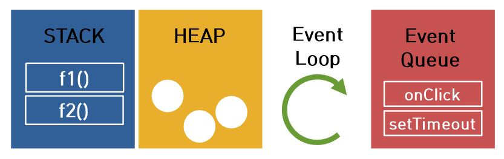

## 1. 자바스크립트 엔진
- Rendering Engine: HTML과 CSS로 작성된 마크업 관련 코드를 웹 페이지에 렌더링 하는 역할
- Javascript Engine: 자바스크립트로 작성한 코드를 해석하고 실행하는 인터프리터. 주로 웹브라우저에서 사용되지만, Node.js가 등장하면서 server side에서는 V8 Engine을 이용한다.  
- 자바스크립트는 싱글 쓰레드 기반으로 동시에 하나의 작업만을 함
- 자바스크립트가 싱글 쓰레드 기반임에도 비동기 처리(Non-Blocking IO)가 가능한 것은 Event Loop 때문
<br/>

#### 1-1. 자바스크립트 엔진 구성
- Call Stack
- Heap
- Event Queue(Task Queue)
- EventLoop



<br/><br/>

## 2. Call Stack
- 자바스크립트 엔진은 요청이 들어오면 해당 요청을 순차적으로 호출 스택에 담아 처리한다.
- 메소드가 실행될 때 call stack에 새로운 프레임이 push 되고, 메소드의 실행이 끝나면 해당 프레임은 pop 된다.
- 자바스크립트는 단 하나의 호출 스택을 사용한다. 즉 하나의 함수가 실행되면 이 함수의 실행이 끝날 때 까지는 어떤 task도 수행될 수 없다.  
- [call stack 예제](https://github.com/yoojh9/learning-javascript-example/blob/master/ch7/call-stack-test.js)  
<br/><br/>

## 3. Heap
- 동적으로 생성된 객체(인스턴스)는 heap에 할당됨
- 구조화되지 않은 '더미'같은 메모리 영역을 'heap'이라고 표현함
<br/><br/>

## 4. Event Queue (Task Queue)
- 자바스크립트의 런타임 환경에서는 처리해야 하는 task들을 임시 저장하는 대기 큐
- 비동기식 이벤트, 비동기 처리 함수의 콜백 함수, setTimeout(), setInterval() 등이 저장됨
- 자바스크립트 엔진이 아닌 Web API 영역에 따로 정의되어 있는 함수들도 비동기로 실행된다
- Call Stack이 비어졌을 때, Event Loop에 의해 순차적으로 Call Stack으로 이동되어 실행됨
- 큐는 먼저 들어온게 먼저 실행되는 구조이다.  

```javascript
setTimeout(function(){
  console.log('first');
},0);
console.log('second');

// console
// second
// first
```  
- [event queue 예제](https://github.com/yoojh9/learning-javascript-example/blob/master/ch7/event-queue-test.js)  
<br/><br/>

## 5. Event Loop
- Call Stack 내에서 현재 실행 중인 task가 있는지, Event Queue에 task가 있는지 반복하여 확인함
- Call Stack이 비워지면(스택에 추가된 모든 함수가 실행되고 끝나면), Event Queue 대기열에 추가된 task를 Call Stack으로 이동하여 실행시킴
<br/><br/>

---
#### 참고
[_Jbee 티스토리, JavaScript의 Event Loop](http://asfirstalways.tistory.com/362) <br/>
[박진형님 티스토리, js엔진은 어떻게 동시처리를 하는가? 이벤트루프](http://jinbroing.tistory.com/98) <br/>
[짱구의 기술블로그, 이벤트루프](https://appear.github.io/2017/09/17/JavaScript/javascript_23)
