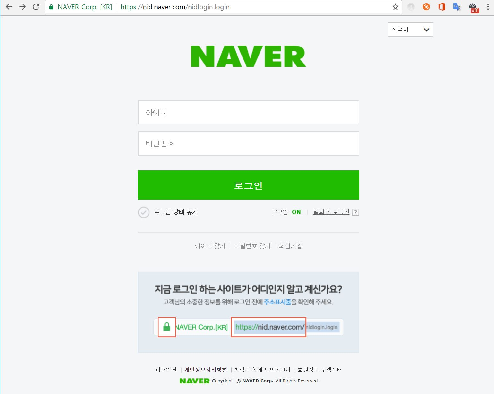

## 1. webdriver
Web Driver는 Chrome, FireFox, Safari 등의 브라우저에서 제공하는 API로 운영체제에 설치된 브라우저를 제어할 수 있다. web driver를 이용하면 단순 패킷 요청만이 아닌 js와 css 조작도 가능하다.
<br/>

#### 1-1. webdriver 설치
- 이 예제에서는 크롬을 사용했고, 크롬 드라이버를 다운받았다.
- [https://sites.google.com/a/chromium.org/chromedriver/downloads](https://sites.google.com/a/chromium.org/chromedriver/downloads)
<br/><br/>

## 2. selenium
selenium은 웹앱을 테스트 하는 데 이용하는 프레임워크로, webdriver api를 통해 브라우저를 제어한다.
<br/>

#### 2-1. selenium 설치방법
파이썬이 이미 설치되어 있음을 가정하고 진행한다.
```
$ pip install selenium
```
<br/><br/>

## 3. 네이버 로그인
selenium을 이용해 네이버에 로그인하는 간단한 기능을 만들어보자.

```python
from selenium import webdriver

driver = webdriver.Chrome("chrome driver 다운로드 경로");
driver.get("https://nid.naver.com/nidlogin.login")
```



<br/>
크롬 개발자 모드(f12)를 통해 각 요소의 name 또는 id 값을 확인한다.  
find_element_by_name() 함수를 이용하여 아이디와 비밀번호를 입력하고 submit 한다.

```python
from selenium import webdriver

driver = webdriver.Chrome("chrome driver 다운로드 경로");
driver.get("https://nid.naver.com/nidlogin.login")

element = driver.find_element_by_name('id')
element.send_keys('user_id')
element = driver.find_element_by_name('pw')
element.send_keys('user_password')
sleep(3);		# 3초 간 sleep
element.submit()
```
<br/>