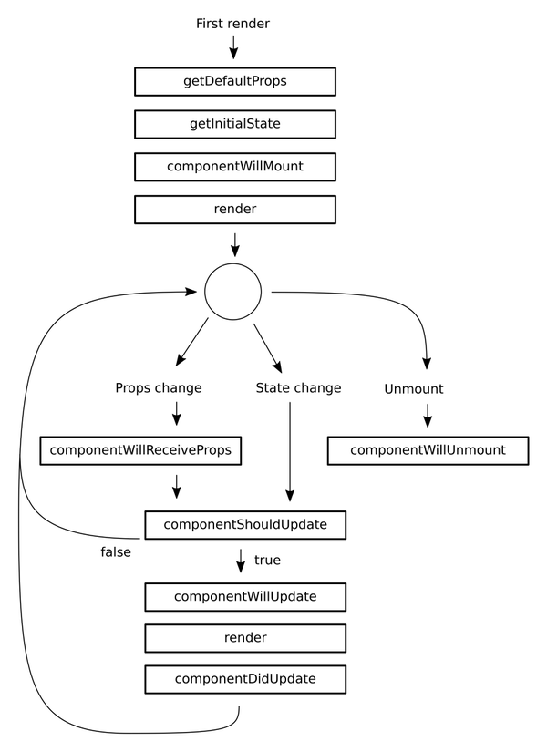

## 1. handling events
- 리액트 이벤트는 camelCase로 이름지어야 한다.
- html 방식과 가장 큰 차이점은 이벤트 전파를 막기 위해 html에서 return false를 전달하는 것과 달리
react에서는 반드시 preventDefault()를 호출해야 한다.
```  
// html
<a href="#" onclick="console.log('The link was clicked.'); return false">
  Click Me
</a>
```  
<br/>

- JSX callback에서의 this는 조심해야 하는데, 자바스크립트에서 함수에는 this가 global 또는 window 객체이므로 원하는 결과를 얻기 어렵다. 때문에 생성자 함수에서 handle events에 this를 바인딩하는 작업이 필요하다
```
 class Togle extends React.Components{
   constructor(props){
     super(props);
     this.handleClick = this.handleClick.bind(this);
   }

   handleClick(){
     // 클릭이벤트
   }
 }
```  
<br/>

- 이벤트는 컴포넌트에는 적용이 안되고, \<div>나 \<input>, \<button>에만 적용됨. 때문에 Contact.js에서 <ContactInfo onClick={()=>{console.log('click')}}/> 과 같은 이벤트는 적용이 안된다.
- 위의 이벤트를 적용시키기 위해서, 이벤트는 컴포넌트에 props로 전달이 되므로 ContactInfo 컴포넌트에 먼저 적용시킨다.

<br/>

## 2. props와 state  

#### 2-1. props
- props는 컴포넌트에서 사용할 데이터 중 변동되지 않는 데이터를 다룰 때 사용된다.
- parent 컴포넌트에서 child 컴포넌트로 데이터를 전달할 때도 props가 사용된다.

<br/>

#### 2-2. state
- 컴포넌트에서 유동적인 데이터를 다룰 때 state를 사용한다.

<br/><br/>


## 3. state 내부 배열 처리하기
- Array.push를 쓰게 되면 배열 자체를 변경시키므로, 만약 state의 내부 배열에 값을 추가하고 싶다면 concat을 사용한다.
- concat은 기존 배열은 그대로 두고 새로운 배열을 생성한다

```
this.setState({
  list: this.state.list.concat(newObj)
})
```
<br/>

- Immutability Helper: 다른 방법으로 객체나 배열을 더 쉽게 수정하게 해주는 immutable.js를 사용한다

<br/>

## 4. Immutability Helper
- 설치 및 import

```
$ npm install --save react-addons-update  // 라이브러리 설치

import update from 'react-addons-update'  // import한 update는 함수 형태
```

<br/>

- 원소 추가

```
// 컴포넌트에서 사용방법
// update( {처리해야 할 객체, 배열}, {처리 명령을 지니고 있는 객체} )

this.setState({
  list: update(
    this.state.list,
    {
      $push: [newObj, newObj2]    // 객체 하나만 추가 하더라도 []로 감싸져야 함
    }
  )
})
```

<br/>

- 원소 제거

```
// list 배열의 index부터 1개의 데이터를 제거함

this.setState({
  list: update(
    this.state.list,
    {
      $splice: [ [index,1], [index2,3] ]
    }  
  )
})
```

<br/>

- 원소 변경

```
// list의 index번 째 아이템의 field와 field2 값을 변경함
// 객체일 경우에는 [index]가 아닌 [key]로 적용

this.setState({
  list: update(
    this.state.list,
    {
      [index]: {
        field: {$set: "value"},
        field2: {$set: "value2"}
      }
    }
  )
})
```

<br/>

## 5. ref
- id와 비슷한 개념

```
class Hello extends React.Component {
  render(){
    return(
      <div>
        <input ref={ (ref) => {this.input = ref} } />
      </div>
    )
  }

  componentDidMount(){
    this.input.value = "Hi, I used ref to do this"
  }

  ReactDom.render(
    <hello/>,
    document.getElementById('app')
  )
}
```

<br/>

## 6. Component LifeCycle API
- 컴포넌트가 DOM 위에 생성되기 전과 후, 데이터가 변경되어 상태를 업데이트 하기 전과 후, 컴포넌트가 DOM에서 사라지기 전에 실행되는 메소드
<br/>

- 컴포넌트 API의 종류
  - componentWillMount : 컴포넌트가 DOM 위에 만들어지기 전에 실행 (DOM 처리를 못함)
  - componenetDidMount : 컴포넌트가 만들어지고 첫 렌더링을 다 마친 후 실행되는 메소드 (다른 자바스크립트 프레임워크 연동 및 setTimeout, setInterval 및 Ajax 사용)
  - componenetWillReceiveProps : 컴포넌트가 새로운 Props를 받았을 때 (props에 따라 state를 업데이트 할 때 사용하면 유용. 이 안에서 setState를 해도 괜찮다.)
  - shouldComponenetUpdate : 컴포넌트가 업데이트를 해야 할지 말아야 할지 정하는 메소드 (prop 혹은 state 가 변경 되었을 때, 리렌더링을 할지 말지 정하는 메소드)
  - componenetWillUpdate : 컴포넌트가 리렌더링 되기 전에 실행 (이 메소드 안에서는 this.setState()를 사용하면 무한루프가 발생하게 됨)
  - componentDidUpdate : 컴포넌트가 리렌더링을 마친 후에 실행 (여기에서도 setState 사용하지 말 것)
  - componentWillUnmount : 컴포넌트가 DOM에서 사라진 후 실행되는 메소드

<br/>

- 컴포넌트 LifeCycle API 다이어그램  
  

<br/>

- 컴포넌트 LifeCycle  


- [React Docs - Component](https://reactjs.org/docs/react-component.html)

<br/>

## 7. localStorage
- localStorage는 HTML5 부터 지원이 되는 데이터 저장 공간
- 쿠키는 도메인 당 4KB가 최대 용량인데 비하여, localStorage는 2.5MB ~ 5MB 까지 저장할 수 있다
- localStorage는 텍스트 형태로 저장되기 때문에 객체형태로 그대로 저장하기 어렵다
- 지금 우리가 만든 Contacts 어플리케이션은 추가해도 새로고침하면 데이터가 유지되지 않음
- Contact.js에 componentWillMount()와 componentDidUpdate()를 추가해보자
- [localStorage 사용법](http://www.w3schools.com/html/html5_webstorage.asp) <br/>

```
 let object = { name : 'jeonghyun' }

 localStorage.girl = object;
 console.log(localStorage.girl);  // "[object Object]"

 localStorage.girl = JSON.stringify(object);
 console.log(localStorage.girl); // "{ "name": "jeonghyun" }"

 let jh = JSON.parse(localStorage.girl);
 console.log(jh); // { name: 'jeonghyun'}
```

<br/>

---
#### 참고
[리액트 주소록 예제 코드](https://github.com/yoojh9/react-example/tree/master/react-contact-example) <br/>
[velopert님 블로그, Component LifeCycle API](https://velopert.com/1130) <br/>
[reactjsprogram](http://reactjsprogram.blogspot.kr/)
