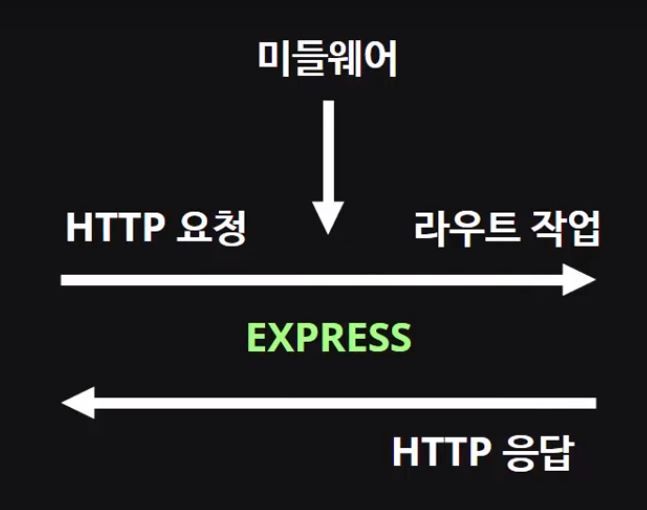

## 1. Express
- 웹서버에서 필요한 대부분의 기능이 구현된 웹 프레임워크
- 라우팅, 세션, 템플릿 등 웹 어플리케이션을 구축하는데 필요한 많은 기능들이 구현되어 있음  

```
$ mkdir express-tutorial
$ cd express-tutorial
$ npm init
$ npm install --save express
```  

<br/><br/>

## 2. 라우팅
- METHOD: HTTP 요청 메소드 - get, post, delete, put...
- PATH: 라우트 경로
- HANDLER: 실행될 콜백 함수  

```
app.METHOD(PATH, HANDLER)
```

<br/><br/>

## 3. Express 미들웨어
- 미들웨어 함수는 요청 오브젝트(req), 응답 오브젝트(res) 그리고 애플리케이션의 요청-응답 주기 중 그 다음의 미들웨어 함수에 대한 엑세스 권한을 갖는 함수이다.
- 미들웨어를 통해 express 자체에 있지 않은 기능을 구현할 수 있음

<br/>



<br/>

- 미들웨어도 콜백 함수이며 다음과 같이 만들어 app.use에 넣어주면 된다

```
// req가 들어왔을 때 다른 것을 처리하기 전에 처리할 작업을 하고 전달받은 next() 콜백함수를 실행
var myLogger = function(req, res, next){
  console.log(req.url);
  next();
};

app.use(myLogger)
```  

<br/>

- 이미 만들어진 미들웨어를 설치해서 사용할 수도 있다 morgan: 로깅 미들웨어, body-parser: JSON 형태 데이터 파싱

```
$ npm install --save morgan body-parser
```  

<br/><br/>

## 4. nodemon
- 코드가 바뀔 때마다 서버를 재시작하지 않도록 해 줌  
- 글로벌로 설치하게 되면 터미널에서 직접 명령어로 실행할 수 있게 해줌
- 원래는 $ node main.js로 실행하던 것을 개발 할 때는 $ nodemon main.js로 실행하게 됨
<br/>

```
$ npm install -g nodemon
$ nodemon main.js
```

<br/><br/>

## 5. 정적(static) 파일 제공

```
app.use('/', express.static('public'));
```  

<br/><br/>

---
#### 참고
[node.js express 예제 코드](https://github.com/yoojh9/react-example/tree/master/express-tutorial) <br/>
[velopert님 강의 - React & Express를 이용한 웹 어플리케이션 개발하기](https://www.inflearn.com/course-status-2/) <br/>
