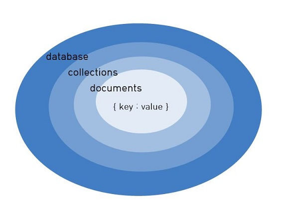

## 1. MongoDB
- NoSQL
- MongoDB 서버 실행: mongod (MongoDB 설치 디렉토리 bin 하위에서 실행)  

<br/>




#### 1-1. MongoDB 서버 시작
- mongod

```
// default data directory path를 사용하지 않으면 명시해야함
C:\Program Files\MongoDB\Server\3.6\bin> mongod --dbpath E:\mongodb\data
```  

#### 1-2. MongoDB 클라이언트로 접속
- mongo

```
C:\Program Files\MongoDB\Server\3.6\bin> mongo
```  

#### 1-3. 사용할 데이터베이스 선택
- use database_name

```
> use db_name
```

#### 1-4. 데이터베이스 리스트 보기
- show dbs
```
> show dbs
```  

#### 1-5. 데이터베이스 제거  
- db.dropDatabase()

```
> use mongodb_tutorial // 제거하기 전에 선택되어야 함
> db.dropDatabase()
{ "dropped" : "mongodb_tutorial", "ok" : 1 }
> show dbs
admin   0.000GB
config  0.000GB
local   0.000GB
```

#### 1-6. 컬렉션 생성
- db.createCollection(name, [options])  

```
> use mongodb_tutorial
switched to db mongodb_tutorial
> db.createCollection("books")
{ "ok" : 1 }
> db.people.insert({"name": "jeonghyun"});
WriteResult({ "nInserted" : 1 })
> show collections
books
people
```

#### 1-7. 컬렉션 제거
- db.collection_name.drop();  

```
> db.books.drop()
true
> show collections
people
```  

#### 1-8. Document 삽입
- db.collection_name.insert(document);

```
> db.books.insert({"name":"Javascript Guide", "author":"Jeonghyun"})

WriteResult({ "nInserted" : 1 })

> db.books.insert([
  {"name":"Java Tutorial","author":"Jeonghyun"},
  {"name":"Node.js start","author":"Jeonghyun"}
  ])

BulkWriteResult({
        "writeErrors" : [ ],
        "writeConcernErrors" : [ ],
        "nInserted" : 2,
        "nUpserted" : 0,
        "nMatched" : 0,
        "nModified" : 0,
        "nRemoved" : 0,
        "upserted" : [ ]
})
```

#### 1-9. 컬렉션 값 조회
- db.collection_name.find([query],[projection])

```
> db.books.find()

{ "_id" : ObjectId("5ab9ea7227e7ade14002f9b1"), "name" : "Javascript Guide", "author" : "Jeonghyun" }
{ "_id" : ObjectId("5ab9eabd27e7ade14002f9b2"), "name" : "Java Tutorial", "author" : "Jeonghyun" }
{ "_id" : ObjectId("5ab9eabd27e7ade14002f9b3"), "name" : "Node.js start", "author" : "Jeonghyun" }

# 예를 들어 value가 100보다 큰 document를 찾고 싶다면
> db.numbers.find({"value":{ $gt:100 } })
```  

- db.collection_name.find().pretty() : 가독성 좋게 볼 수 있음

<br/>

#### 1-10. document 제거
- db.collection_name.remove(criteria,[justone])
- criteria 는 제거할 기준, justone은 기본적으로 false임  

```
> db.books.remove({"name":"Node.js start"})
WriteResult({ "nRemoved" : 1 })

> db.books.remove({"author":"Jeonghyun"}, true);
```  

<br/><br/>

## 2. MongoDB query 비교 연산자

| Opertaion | 설명 |
|:-----|:-----|
| $eq |  equals |
| $gt |  greater than |
| $gte | greater than or equals  |
| $lt |  less than  |
| $lte |  less than or equals  |
| $ne | not equals  |
| $in | 주어진 배열 안에 속하는 값  |
| $nin | 주어진 배열 안에 속하지 않는 값  |  


```
> db.numbers.find({"value": {$gt: 0, $lt:100} })
```

<br/><br/>

## 3. MongoDB query 논리 연산자

| Opertaion | 설명 |
|:-----|:-----|
| $or |  주어진 조건 중 하나라도 true일 때 true |
| $and |  주어진 조건이 모두 true일 때 true |
| $not | 주어진 조건이 false일 때는 true  |
| $nor |  주어진 조건이 모두 false 일때 true  |

```
> db.articles.find({$or: [{ "title" : "article01"}, { "writer" : "Alpha"} ]})

> db.articles.find( { $and: [ { "writer": "Velopert" }, { "likes": { $lt: 10 } } ] } )

# and는 이렇게도 가능하다
> db.articles.find( { "writer": "Velopert", "likes": { $lt: 10 } } )
```

<br/><br/>

## 4. $where 연산자
- javascript expression을 사용할 수 있다.

```
> db.articles.find( { $where: "this.comments.length == 0" } ).pretty()
{
        "_id" : ObjectId("5ab9f48727e7ade14002f9b4"),
        "title" : "article01",
        "content" : "content01",
        "writer" : "Velopert",
        "likes" : 0,
        "comments" : [ ]
}
```

<br/><br/>

## 5. $elemMatch 연산자
- sub document(embedded document) 배열을 쿼리할 때 사용한다

```
> db.articles.find({"comments":{ $elemMatch: { "name": "Charlie"} } }).pretty()
```

---

#### 참고  
[velopert님 강의 - MongoDB](https://velopert.com/mongodb-tutorial-list) <br/>
[velopert님 블로그 - MongoDB](https://velopert.com/mongodb-tutorial-list) <br/>
[PoiemaWeb - MongoDB의 기본 개념과 설치](http://poiemaweb.com/mongdb-basics) <br/>
