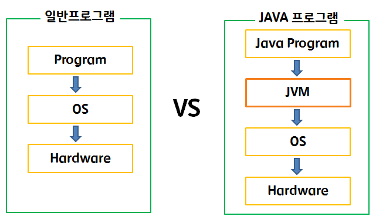

## 1. 리터럴
- 변수의 초기값은 코드에서 직접 입력하는 경우가 많은데, 소스코드 내에서 직접 입력된 값을 리터럴(literal)이라고 부른다. 
- 리터럴은 값의 종류에 따라 정수 리터럴, 실수 리터럴, 문자 리터럴, 논리 리터럴로 구분된다.

  

## 2. 데이터 타입  
#### 2-1. 기본타입과 참조타입
- 기본 타입(primitive type)이란 정수, 실수, 문자, 논리 리터럴을 저장하는 타입
- 참조 타입(reference type)이란 객체(Object)의 번지를 참조하는 타입으로 배열, 열거, 클래스, 인터페이스 타입을 말한다.
- 기본 타입인 byte, char, short, int, long, float, double, boolean을 이용해서 선언된 변수는 실제값을 변수 안에 저장하지만, 참조 타입인 배열, 열거, 클래스, 인터페이스를 이용해서 선언된 변수는 메모리의 번지를 값으로 갖는다. 번지를 통해 객체를 참조한다는 뜻에서 참조 타입이라고 부른다.  

 

#### 2-2. 참조 변수의 ==, != 연산
- 기본 타입 변수의 ==, != 연산은 변수의 값이 같은지 아닌지를 조사하지만 참조 변수들 간의 ==, != 연산은 동일한 객체를 참조하는지 알아 볼 때 사용한다.

  

## 3. JVM
- 프로그램이 실행되기 위해서는 windows나 linux와 같은 운영체제가 제어하고 있는 시스템의 리소스의 일부인 메모리(RAM:주기억장치)를 제어할 수 있어야 하는데, java 이전의 c같은 대부분의 언어로 만들어진 프로그램은 이러한 이유 때문에 OS에 종속되어 실행되게 되어 있었다.
- java 프로그램은 JVM(Java Virtual Machine: 자바가상머신)이라는 프로그램만 있으면 실행이 가능한데, JVM이 OS에게서 메모리 사용권한을 할당 받고 JVM이 자바프로그램을 호출하여 실행하게 된다. OS에게는 독립되었지만 JVM이라는 프로그램에는 종속적이게 된다.
- JVM은 JAVA와 OS사이에서 중계자 역할을 하며, 메모리 관리(Garbage Collection)의 역할도 수행한다.
 

  
## 4. JVM 메모리 구조  
- 프로그램이 실행되면, JVM은 OS로부터 이 프로그램이 필요로 하는 메모리를 할당받고, JVM은 이 메모리를 용도에 따라 여러 영역으로 나누어 관리한다.

- Java Source: 사용자가 작성한 JAVA 코드
- Java Compiler: JAVA 코드를 Byte Code로 변환시켜주는 기능
- Class Loader: Class파일을 메모리(Runtime Data Area)에 적재하는 기능
- Execution Engine: Byte Code를 실행 가능하게 해석해주는 기능
- Runtime Data Area: 프로그램을 수행하기 위해 OS에서 할당 받은 메모리 공간

 
#### 4-1. 메소드(Method)영역 (= 클래스 영역, static 영역)
- 메소드 영역에는 코드에서 사용되는 클래스(~.class)들을 클래스 로더로 읽어 클래스 정보, static 변수, 변수 정보, 메소드 정보, 상수 pool, 생성자 코드 등을 분류해서 저장한다.
- 메소드 영역은 JVM이 시작될 때 생성되고 모든 스레드가 공유하는 영역이다.
- static: '정적인, 고정인, 움직이지 않는'의 의미를 가진다. JVM 메모리에 고정됨을 뜻함과 동시에 모든 객체가 '공유'한다는 의미를 뜻한다. 때에 따라 모든 인스턴스가 같은 값을 공유하고 싶을 때가 있는데 이런 경우 static 키워드를 멤버변수 앞에 붙이면 클래스 소속의 변수가 된다. 물론 메소드도 마찬가지이다. static이 실행되는 시점은 클래스가 메모리 상에 올라갈 때 이며, static이 붙은 변수를 클래스 변수라고 하는 것은 변수가 존재하는 영역이 클래스가 존재하는 영역과 같기 때문이다.

 
#### 4-2. 힙(Heap) 영역
- 힙 영역은 객체와 배열이 생성되는 영역이다. 힙 영역에 생성된 객체와 배열은 JVM 스택 영역의 변수나 다른 객체의 필드에서 참조한다. 참조하는 변수나 필드가 없다면 의미 없는 객체가 되기 때문에 이것을 쓰레기로 취급하고 JVM은 쓰레기 수집기(Garbage Collector)를 실행시켜 쓰레기 객체를 힙 영역에서 자동으로 제거한다.

 
#### 4-3. JVM 스택(Stack) 영역
- JVM 스택 영역은 각 스레드마다 하나씩 존재하며 스레드가 시작될 때 할당한다. 자바 프로그램에서 추가적으로 스레드를 생성하지 않았따면 main 스레드만 존재하므로 JVM 스택도 하나이다.
- JVM 스택은 메소드를 호출할 때마다 프레임을 추가(push)하고 메소드가 종료되면 해당 프레임을 제거(pop)하는 동작을 수행한다. 
- 프레임 내부에는 로컬 변수 스택이 있는데, 기본 타입 변수와 참조 타입 변수가 추가(push)되거나 제거(pop)된다. 변수가 이 영역에 생성되는 시점은 초기화 될 때, 즉 최초로 변수에 값이 저장될 때 이다. 변수는 선언된 블록 안에서만 스택에 존재하고 블록을 벗어나면 스택에서 제거된다.
- null도 초기값으로 사용될 수 있으므로 null로 초기화된 참조 변수도 스택 영역에 존재한다.

---
#### 참고
[이것이 자바다 신용권의 Java 프로그래밍 정복]()  
[어떤공간님의 JVM 메모리구조](http://huelet.tistory.com/entry/JVM-%EB%A9%94%EB%AA%A8%EB%A6%AC%EA%B5%AC%EC%A1%B0)  
[nroo 개발자의 기록습관 - Static Keyword 와 Method Area](http://huelet.tistory.com/entry/JVM-%EB%A9%94%EB%AA%A8%EB%A6%AC%EA%B5%AC%EC%A1%B0)  